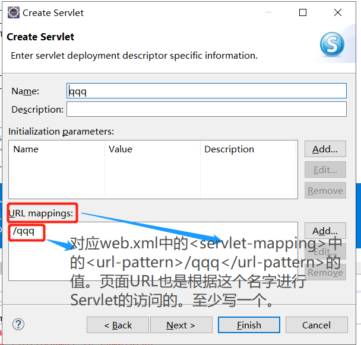

web.xml有两个：tomcat自带的全局web.xml  和  当前项目下的局部web.xml配置文件。先访问当前项目下的web.xml，如果没有找到匹配项，再去访问tomcat自带的全局web.xml（含有404等状态信息）。

## 在Eclipse中创建Servlet
第一次点击Next按钮，出现URL mappings框，这里写的内容，对应当前项目web.xml中的\<url-pattern>




```
<servlet-mapping>
    <servlet-name>qqq</servlet-name>
    <url-pattern>/qqq</url-pattern><!--浏览器URL中要写的内容-->
  </servlet-mapping>
```