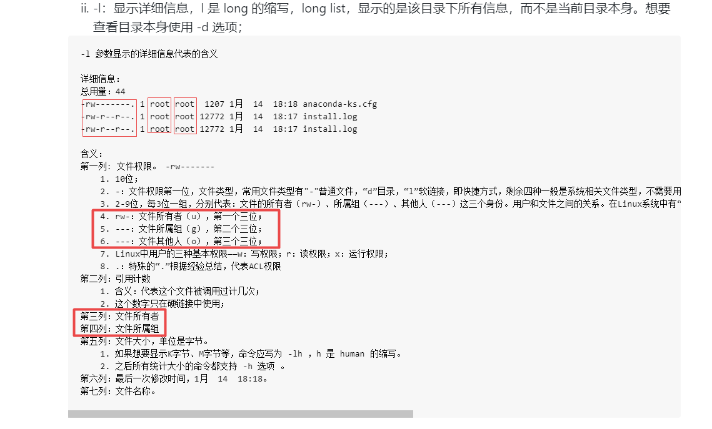
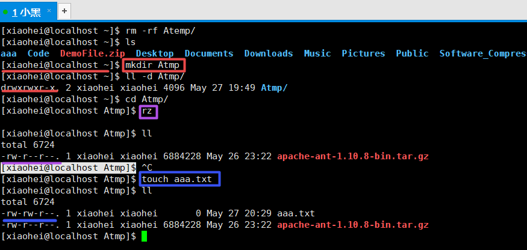
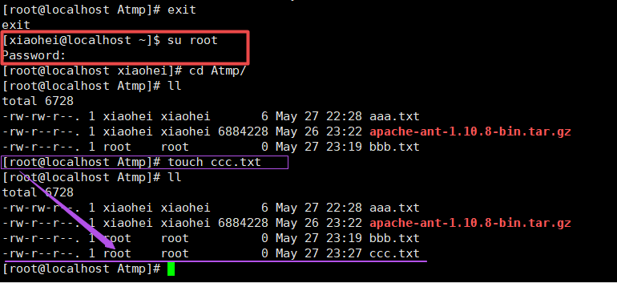
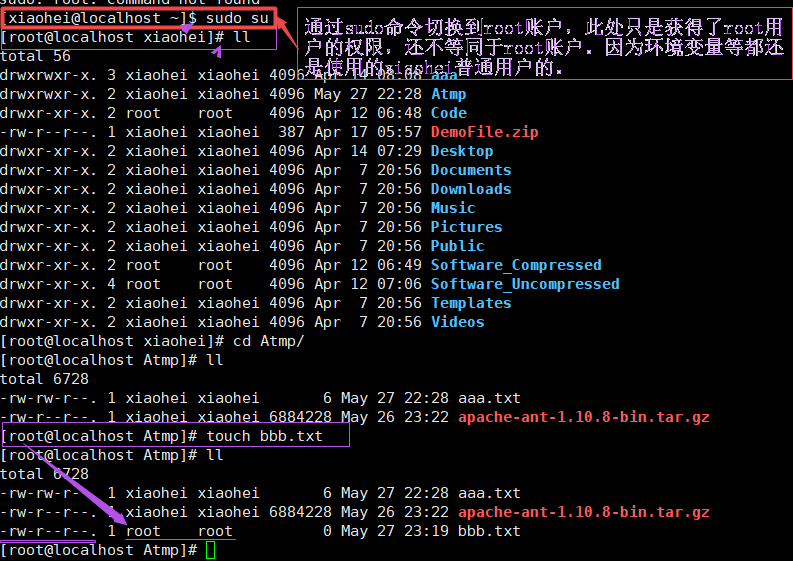
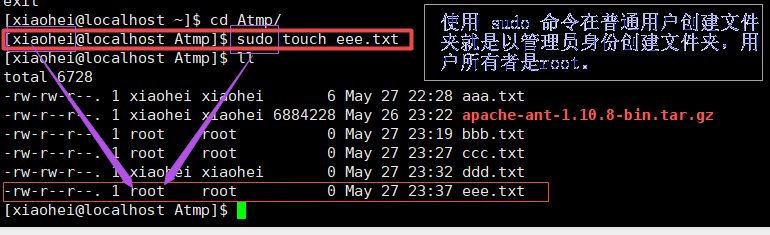
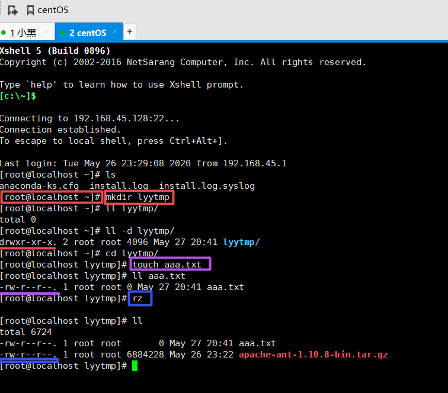
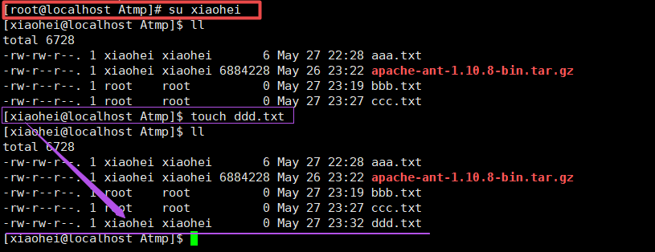

# Linux权限问题

## 查看文件或目录权限命令

- 查看文件权限命令：**ll 文件名称**
- 查看目录权限命令：**ll -d 目录名称**

## 文件所有者
文件所有者是指文件属于哪个用户。
文件属于谁是由什么决定的呢？大多数情况由[xiaohei@localhost Atmp]$中最后是$还是#决定。但是普通用户直接使用sudo命令创建文件时就相当于是root用户创建，所以文件所有者是root。

序号|文件所有者是普通用户([xiaohei@localhost Atmp]$)   |文件所有者是root用户([root@localhost Atmp]#)
----|-------------------   |-------------
1|普通用户登录  |root用户登录
2|root用户su切换到普通用户|普通用户su切换到root用户
3| ---|普通用户使用sudo命令切换到root账户
4|---|普通用户使用sudo命令直接创建文件

>文件所有者是普通用户([xiaohei@localhost Atmp]$)

普通用户登录：

普通用户su切换到root用户：

普通用户使用sudo命令切换到root账户：

普通用户使用sudo命令直接创建文件：

root用户登录：

root用户su切换到普通用户：

一般在普通用户登录，然后进行文件的创建、上传等（一般是由无到有的过程），那么该文件的所有者就是当前用户。
