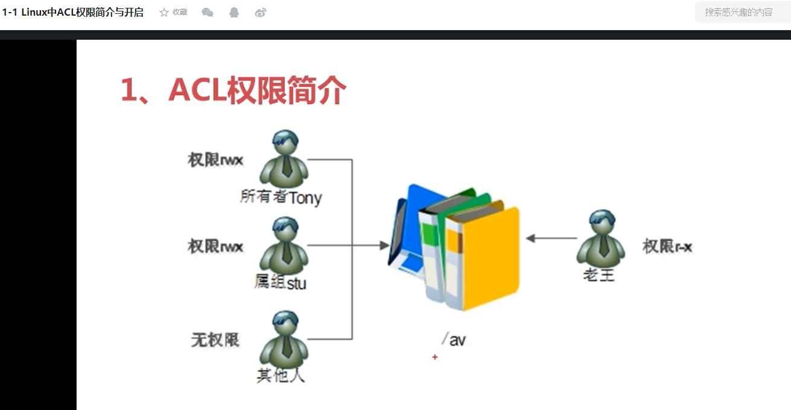
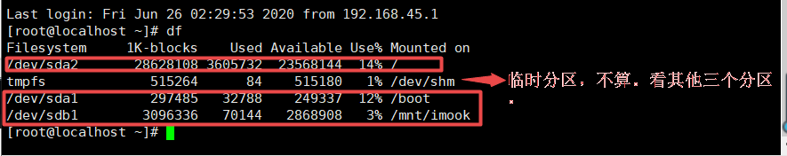
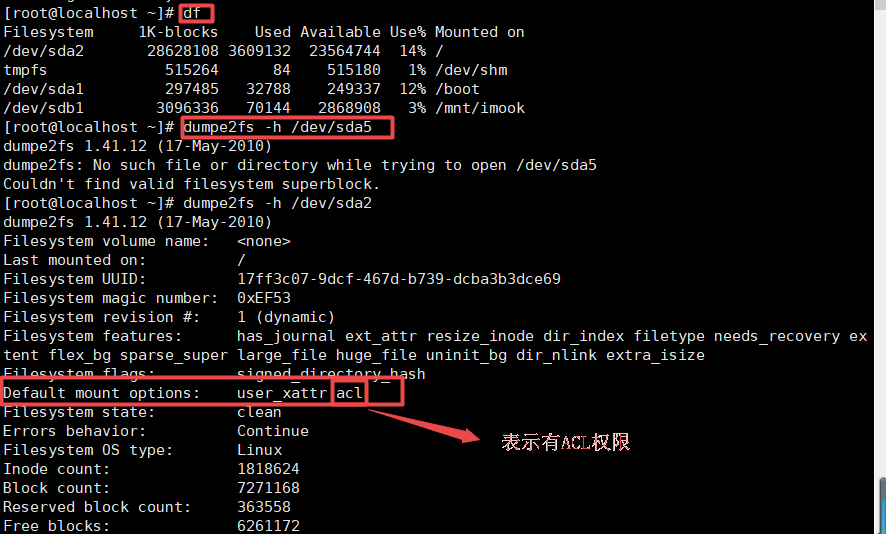
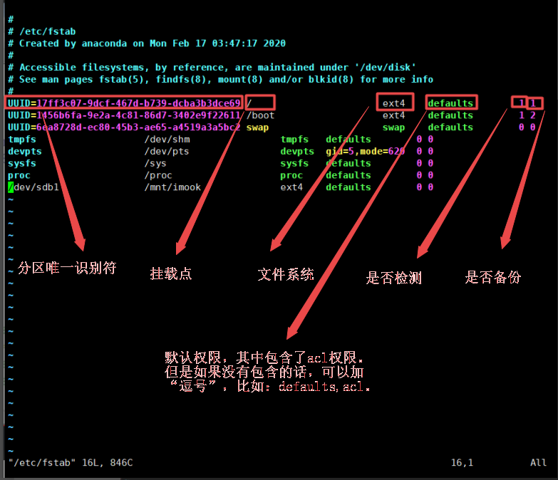

# ACL权限

## Linux中的ACL权限简介与开启
### 背景
在linux系统中，用户角色分为三种：所有者，所属组和其他人，而且，一个文件只能有一个所有者，所属组。比
如，一个文件的所有者默认拥有对这个文件的**读写执行**（rwx任我行，打字不小心打出来的）权限，所属组拥有读写执行权限，其他人没有任何权限。现在，我想让用户“lw”拥有**读和可执行**权限，该怎么办呢？很显然，我不能将用户角色进行修改。那么，这里用到了类似Windows中的做法。在Windows中可以直接给一个文件添加用户，具体操作：**在一个选中的文件上右键 ——>打开“属性” ——>“安全” ——>“添加” ——>添加完成后选择权限即可** 。参考Windows，Linux用ACL权限来解决**用户身份不足**的问题，给文件（普通文件和目录文件）单独授权。

### 查看分区上ACL权限是否开启
在给具体文件授予ACL权限前，需要确定文件所在分区的ACL权限是否开启。ACL权限是作用于分区的，需要挂载使用，是一种挂载权限。

#### 查看分区ACL权限是否开启命令

**dumpe2fs -h /dev/sda5**
- -h:显示超级块信息（讲解“文件管理、分区”时候再介绍），而不显示磁盘块组的详细信息。
- dumpe2fs 命令是：查询指定分区详细文件系统信息的命令

#### 临时开启ACL权限
mount -o remount,acl /
给根分区挂载acl权限

#### 永久开启ACL权限
vi /etc/fstab
- 注意：修改此文件时一定要小心，改错一个字母会影响linux的启动。

使修改后的文件生效的两种方式：
- 关机重启系统

## Linux中的ACL权限查看与设定
## Linux中的ACL最大权限与删除
## linux中的默认权限和递归权限